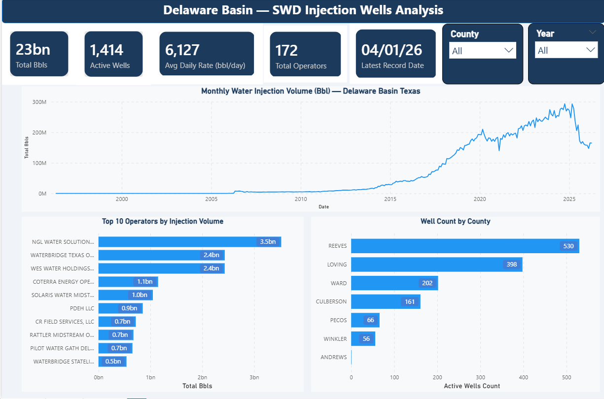
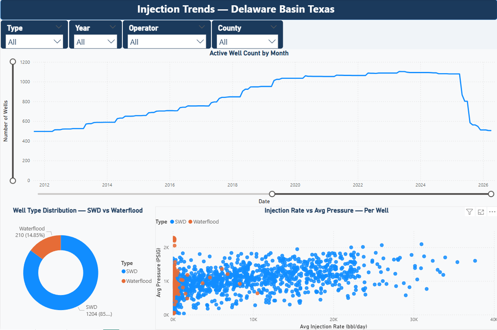
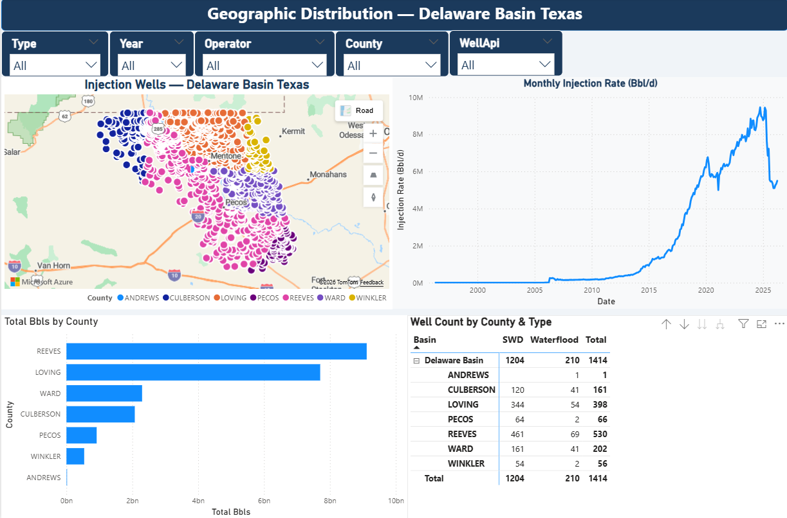

# 🛢️ Texas Injection Wells — Delaware Basin Analysis

**Author:** Juan David Antolinez | Petroleum Engineer → Data Analyst  
**LinkedIn:** [juandantolinez](https://www.linkedin.com/in/juandantolinez/)  
**GitHub:** [juand009](https://github.com/juand009)

---

## 📌 Project Overview

End-to-end data pipeline built around **real-world Oil & Gas data** from the Texas Railroad Commission (RRC). This project demonstrates the full analytical workflow — from automated web scraping to geospatial analysis — applied to saltwater disposal (SWD) wells in the Delaware Basin, Texas.

**Dataset:** 175,838 monthly injection records | 1,414 unique wells | 1997–2025 | 7 counties

---

## 🗺️ Study Area

The **Delaware Basin** is a sub-basin of the Permian Basin located in West Texas and Southeast New Mexico — one of the most prolific oil-producing regions in the world. This project focuses exclusively on the **Texas portion**, covering Reeves, Loving, Ward, Culberson, Pecos, Winkler, and Andrews counties.

---

## 📁 Repository Structure

```
texas-injection-wells/
├── notebooks/
│   ├── 01_polygon_and_wells.ipynb    # EIA shapefile download + spatial well filter
│   ├── 02_scraper_injection.ipynb    # Selenium/BeautifulSoup H10 scraper
│   ├── 03_cleaning.ipynb             # Data cleaning & QA/QC
│   ├── 04_georeferencing.ipynb       # Attach coordinates to injection records
│   └── 05_eda.ipynb                  # Exploratory Data Analysis + maps
├── data/
│   ├── raw/                          # Scraped raw data (gitignored)
│   └── processed/                    # Clean final dataset (gitignored)
├── shapefiles/                        # Delaware Basin polygon (gitignored)
├── dashboard/                         # Power BI dashboard (.pbix)
├── .gitignore
└── README.md
```

---

## 🔄 Pipeline

```
EIA Open Data          Texas RRC Open Data
(Shapefile)            (Socrata API)
      │                      │
      ▼                      ▼
01_polygon_and_wells.ipynb
  → Download Delaware Basin boundary
  → Clip to Texas (lat ≤ 32.0)
  → Identify 2,875 SWD wells inside polygon
      │
      ▼
02_scraper_injection.ipynb
  → Selenium + BeautifulSoup scraper
  → Visits Texas RRC H10 portal well by well
  → Extracts monthly injection records (~8h runtime)
  → Incremental update logic (skip complete months, update empty ones)
      │
      ▼
03_cleaning.ipynb
  → Remove null BBLS rows (-12,637)
  → Remove zero-injection wells (-44,340 rows)
  → Deduplicate (-343 rows)
  → Rename & standardize columns
  → Calculate derived fields
      │
      ▼
04_georeferencing.ipynb
  → LEFT JOIN injection data with well coordinates
  → Attach GisLatNad83 / GisLongNad83 to every record
      │
      ▼
05_eda.ipynb + Power BI Dashboard
  → 5 business questions answered with charts and maps
```

---

## 🧠 Business Questions Answered

| # | Question | Insight |
|---|---|---|
| 1 | How has injection volume evolved over time? | Shale boom visible from 2014; COVID dip in 2020; strong recovery |
| 2 | Which operators inject the most water? | NGL Water Solutions leads with 3.5B+ barrels |
| 3 | How has active well count changed? | Peak of ~1,100 wells in 2022–2023 |
| 4 | Which county has the most activity? | Reeves County dominates with 530+ wells |
| 5 | How are wells distributed geographically? | Dense clusters near Pecos and northern Delaware |

---

## 🛠️ Tech Stack

| Tool | Purpose |
|---|---|
| **Python 3.12** | Core language |
| **Selenium + BeautifulSoup** | Web scraping (RRC H10 portal) |
| **Pandas** | Data manipulation & cleaning |
| **GeoPandas + Shapely** | Geospatial processing |
| **Matplotlib + Contextily** | Data visualization & mapping |
| **Socrata API (sodapy)** | Well coordinates download |
| **Power BI** | Interactive dashboard |

---

## 🚀 How to Run

### 1. Clone the repository
```bash
git clone https://github.com/juand009/texas-injection-wells.git
cd texas-injection-wells
```

### 2. Install dependencies
```bash
pip install pandas geopandas selenium beautifulsoup4 sodapy contextily matplotlib openpyxl
```

### 3. Run notebooks in order
```
01 → 02 → 03 → 04 → 05
```

> ⚠️ **Notebook 02** (scraper) requires Chrome + ChromeDriver installed.  
> Runtime: ~8 hours for 2,875 wells. The incremental logic allows safe interruption and resumption.

---

## 📊 Dashboard Preview

### Overview


### Trends


### Geographic Map



## 📊 Key Results

- **175,838** monthly injection records collected and cleaned
- **1,414** unique SWD wells georeferenced
- **28 years** of injection history (1997–2025)
- Injection volume grew **~100x** from 2005 to 2022 — driven by the Permian shale boom
- **NGL Water Solutions Permian** is the largest operator by volume (3.5B+ Bbls)
- **Reeves County** accounts for ~37% of all active wells

---

## 👤 About

Petroleum Engineer with hands-on experience in Oil & Gas data analysis, injection well databases, and business intelligence. This project was built to demonstrate end-to-end data skills — web scraping, spatial analysis, ETL, and dashboarding — applied to a domain I know deeply.

Trilingual: Spanish 🇨🇴 | English 🇺🇸 | French 🇫🇷

---

*Data sourced from the [Texas Railroad Commission](https://www.rrc.texas.gov/) (public) and [U.S. Energy Information Administration](https://www.eia.gov/) (public).*
